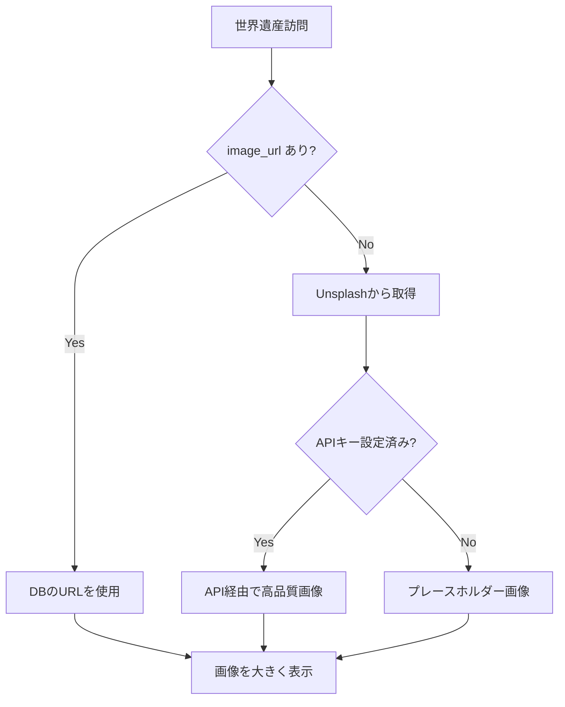

# 🏛️ 世界遺産画像表示機能

## 概要

世界遺産を訪問した際に、その場所の美しい画像を大きく表示する機能です。

## 機能

### 1. 画像の自動表示
- 世界遺産（`category: 'world_heritage'`）を訪問すると、画像が**大きく表示**されます
- スマホ: 256px（h-64）
- PC: 320px（h-80）
- 通常の名所: 128px（h-32）

### 2. 画像ソース

#### 優先順位
1. **データベースのimage_url**: attractionsテーブルに保存されたURL
2. **Unsplash プレースホルダー**: image_urlがない場合、自動的にUnsplashから画像を取得

#### Unsplash API（オプション）
高品質な画像を取得するには、Unsplash APIキーを設定してください：

```bash
# .env.local に追加
NEXT_PUBLIC_UNSPLASH_ACCESS_KEY=your-api-key-here
```

**APIキーの取得方法**:
1. https://unsplash.com/developers にアクセス
2. アカウント作成（無料）
3. 新しいアプリケーションを作成
4. Access Keyをコピー

**制限**:
- 無料枠: 50リクエスト/時間

### 3. 画像キャッシング

画像URLはメモリにキャッシュされるため、同じ世界遺産を複数回訪問しても再リクエストは発生しません。

## 実装詳細

### コンポーネント構成

```
AttractionEvent (世界遺産イベント)
  ↓
EventModal (モーダル表示)
  ↓ (isWorldHeritage=true の場合)
大きな画像表示 (h-64 md:h-80)
```

### 画像取得フロー



## データベース更新

attractionsテーブルのimage_urlカラムに画像URLを設定できます：

```sql
-- 例: ピラミッドの画像URL設定
UPDATE attractions
SET image_url = 'https://images.unsplash.com/photo-...'
WHERE name = 'Pyramids of Giza';
```

### 推奨される画像仕様
- 解像度: 1080px × 720px 以上
- 比率: 16:9 または 3:2
- フォーマット: JPEG, WebP
- ライセンス: フリー素材（Unsplash, Pexels, Pixabayなど）

## カスタマイズ

### 画像サイズの変更

`components/game/EventModal.tsx` の以下の行を編集：

```typescript
// 世界遺産の場合の画像サイズ
const imageHeight = isWorldHeritage ? 'h-64 md:h-80' : 'h-32';

// フルスクリーンにする場合
const imageHeight = isWorldHeritage ? 'h-screen' : 'h-32';
```

### 世界遺産バッジの位置

`EventModal.tsx` 内の以下の部分を編集：

```typescript
<div className="absolute top-2 right-2 bg-amber-500 ...">
  <span>🏆</span>
  <span>世界遺産</span>
</div>
```

## トラブルシューティング

### 画像が表示されない場合

1. **コンソールエラーを確認**
   ```bash
   [Unsplash] Demo mode - using placeholder image
   ```
   → APIキーが未設定。プレースホルダー画像が使用されます。

2. **画像URLが無効**
   - データベースのimage_urlが正しいか確認
   - URLがHTTPSであることを確認

3. **CORS エラー**
   - Unsplash/Pexels等のフリー素材サービスを使用してください
   - 独自サーバーの画像はCORS設定が必要な場合があります

### 画像の読み込みが遅い

1. **画像を事前に設定**
   - マイグレーションでimage_urlを設定
   - 動的取得ではなくDB保存を推奨

2. **CDN経由の画像を使用**
   - Unsplash CDN（`images.unsplash.com`）
   - Cloudflare Images等

## パフォーマンス最適化

### 推奨事項

1. **事前設定**: 主要な世界遺産52件のimage_urlを事前にデータベースに保存
2. **遅延読み込み**: Next.js の Image コンポーネントを使用
3. **WebP形式**: 圧縮率の高いWebPフォーマットを使用

## 今後の拡張案

- [ ] 画像のプリロード機能
- [ ] 複数画像のスライドショー
- [ ] 360度パノラマビュー
- [ ] ARビューアー連携
- [ ] 画像のお気に入り機能

## ライセンス

Unsplash画像のライセンス:
- 商用利用可能
- 帰属表示不要（推奨はされる）
- 詳細: https://unsplash.com/license
